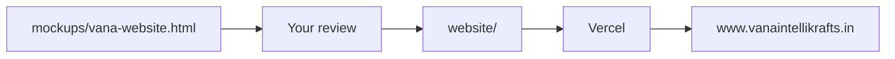

# Vana company website and domain go-live

> Review mockup first: open [`mockups/vana-website.html`](../mockups/vana-website.html) in a browser at 390px and 1440px before promoting to production.

## Status

| Todo | Status |
|------|--------|
| Mockup for review | Done — `mockups/vana-website.html` (v2: Abhyaas-matched graph, unified orange theme, Inter only, YouTube thumbnail) |
| Promote to `website/` + Privacy/Terms | Done |
| GitHub + Vercel deploy | Done — [website-tau-sandy-79.vercel.app](https://website-tau-sandy-79.vercel.app) |
| GoDaddy DNS → www | Done |
| Verify live HTTPS | Done — https://www.vanaintellikrafts.in |

## What this site is for

Reviewers for [Google for Startups Cloud](https://startup.google.com/cloud/), Startup India, AWS Activate, and MongoDB for Startups typically open the company URL in under a minute. They look for: a **real legal entity**, a **live product**, **no overstated claims**, and a **business email whose domain matches the website**.

Your live product is [Abhyaas](https://abhyaas.co.in). This site is the **parent company** page: entity, product, tech, India impact, contact.

## Gate: mockup first

Do not treat [`mockups/index.html`](../mockups/index.html) (Gemini draft) as source of truth.

## Decisions (locked)

- **Stack:** Static HTML/CSS/JS on Vercel (not Angular).
- **Mobile-first:** Stack hero/graph/founders at 390px. **Hamburger + drawer only below 768px.** Laptop: inline nav — **no hamburger**.
- **Design:** Logo-led teal/green, light surfaces, bento + glass. Abhyaas product card stays **orange + charcoal**.
- **Legal name:** Vana Intellikrafts Solutions Private Limited. CIN `U62091RJ2026PTC116675`. PAN `AAMCV5367N`. DOI **01/08/2026**. Address: **106, SHANTI NAGAR, GURJAR KI THADDI, Shyam Nagar (Jaipur), Jaipur-302019, Rajasthan**.
- **DPIIT:** Applying only — never “recognized.”
- **Pitch deck:** Not on the public site (`assets/abhyaas_pitch_deck.pdf` stays private).
- **Email:** `founder@vanaintellikrafts.in`
- **GoDaddy API keys:** Store in gitignored `.env` only — never commit. Rotate after DNS is live.

## Honest product story

**Live (Abhyaas):** free diagnostic quiz, statistical Prelims band, PYQs + exam-level items, topic drills, daily practice.

**Pipeline (never “Live”):** Mains OCR + rubric NLP, AI mentorship, broader GenAI synthesis.

Do not claim the company already runs on Google Cloud.

## What raises odds (do not fake)

**On site:** demo video [youtu.be/z1-Znoo_y5s](https://youtu.be/z1-Znoo_y5s), qualitative “live product” line, JSON-LD, Privacy/Terms, matching domain email in footer.

**Off site:** working `founder@` mailbox, GCP/AWS billing on same domain email, consistent facts on every form, LinkedIn when it exists.

**Skip:** partner logos, fake user counts, empty blog, fake testimonials.

## Mockup sections

1. Sticky nav (hamburger mobile-only)
2. Hero + looping Abhyaas score-band graph
3. YouTube demo embed
4. Live vs pipeline bento
5. Architecture
6. India impact
7. Leadership (Priti CEO/Chairperson, Ashish Co-founder)
8. Entity block + footer
9. JSON-LD Organization

## After sign-off

Promote to `website/` with `privacy.html`, `terms.html`, `robots.txt`, `sitemap.xml`, favicon, OG tags, canonical `https://www.vanaintellikrafts.in/`. GitHub → Vercel → GoDaddy DNS. Apex 301 to www.

## Verification

- Mockup: 390px and 1440px in browser
- Live: HTTPS www, apex redirect, no “DPIIT recognized”
